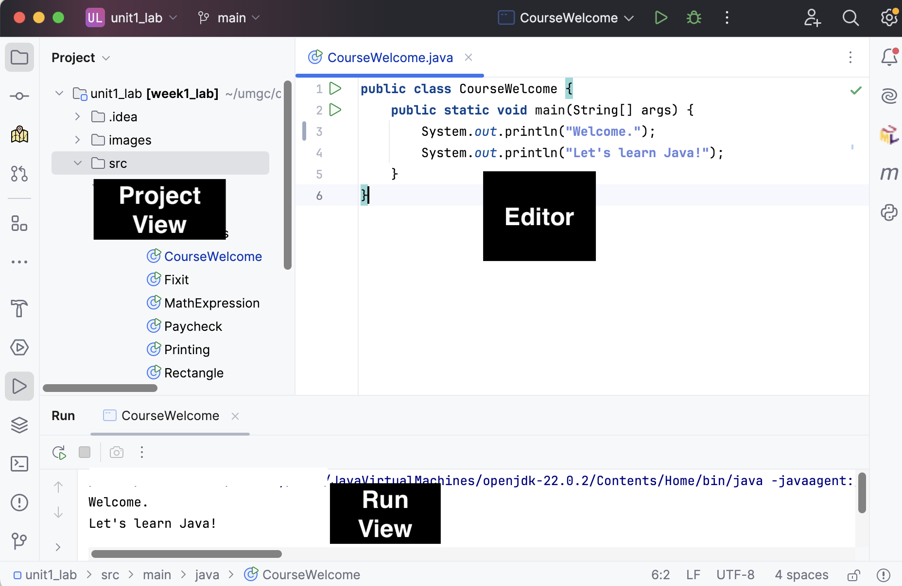
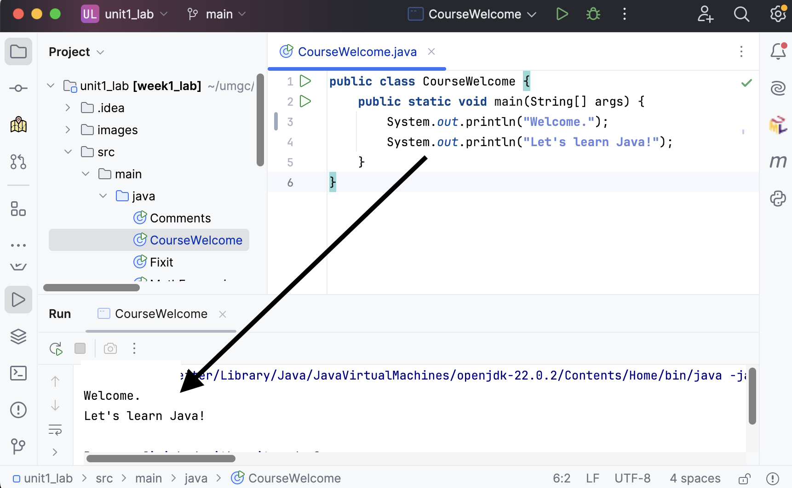
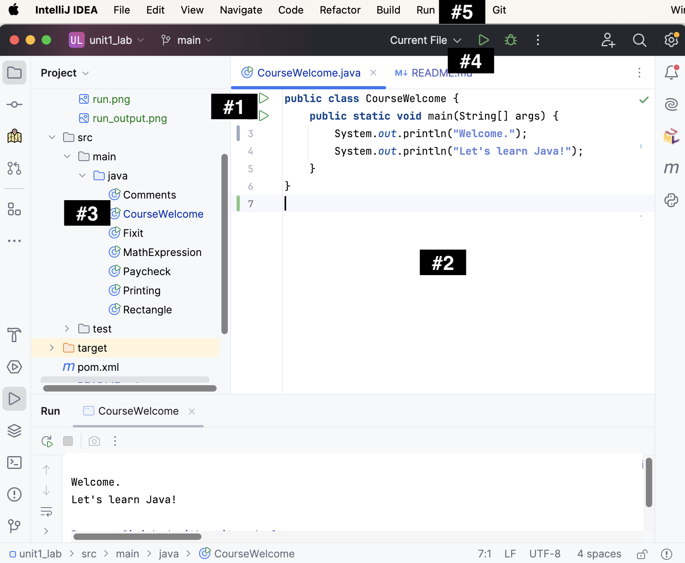
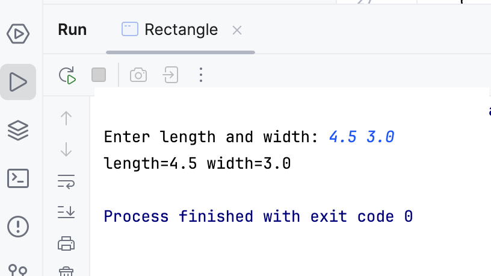

# CMSC 115 Unit 1 Lab

## Learning Objectives

- Run, test, and edit a Java class
- Use single-line and multi-line (block) comments
- Declare, initialize, and update a variable.
- Use numeric operators in calculations.
- Use a `Scanner` to read user input.
- Identify and fix common syntax errors

## Setup

**Note:** Instructions for accessing IntelliJ on Mars and installing IntelliJ on your local machine can be found in a separate document.

IntelliJ is a robust interactive development environment (IDE). The user interface consists of a project view on the left that lists files and folders, and an editor on the right where the contents of opened files are displayed. When you run a program, the output appears in the run view at the bottom of the window.



You can adjust the size of the various views as needed. For instance, if you need more space for the editor, you can close the project view. To toggle the visibility of the project view, click the folder button in the activity sidebar, or navigate to View > Tool Windows > Project from the top menu.


For now, ensure the project view is visible. The CMSC 115 Unit#1 lab files are located in the `src > main > java` folder.

For additional information about IntelliJ, including how to customize the appearance and accessibility settings, refer to the links in the resources section at the bottom of this lab.

## Task 1 - CourseWelcome

Let's examine a simple Java program that prints a greeting.
Double-click on **CourseWelcome** in the project view to open the file in the editor.

A Java class with a `main` method represents an executable program. 
- The `main` method is automatically called when you run the program.  
- The `main` method contains two print statements, each outputting the text enclosed in double quotes.



### Run CourseWelcome

There are several ways to run the `main` method.

1. Click the green run arrow to the left of the class header or the main method.
2. Right-click in the editor window and select **Run CourseWelcome.main()**.
3. Right-click on  **CourseWelcome** in the project view and select **Run CourseWelcome.main()**.
4. Select **Current File** and then click the green run arrow in the project toolbar.
5. Select **Run > Run CourseWelcome** from the top menubar.



Experiment with the different ways to run the CourseWelcome class. Confirm the following two lines of output are produced.

```text
Welcome.
Let's learn Java!
```


### Run CourseWelcomeTest

The current code produces the text shown in the **Actual Output** column below.
However, assume the code should produce the text in the **Expected Output**
column.

| Expected Output           | Actual Output |
| ------------------------ |---------------|
| Welcome to CMCS 115.<br>Let's learn Java! | Welcome.<br>Let's learn Java!|


Many of the tasks you'll do will involve writing
a program to produce some expected output. For each task, 
you need to test the program to check the output.

We'll use a very popular testing framework named Junit.
Expand the test folder in the project view as shown in the screenshot below.
The test folder contains a Junit test class for each regular Java class.  For example, CourseWelcomeTest is the Junit test for the CourseWelcome class.


Don't worry about understanding the code in CourseWelcomeTest. 
For now, you'll just run the test to check the result.

1. Right-click on **CourseWelcomeTest** in the project view, then select **Run CourseWelcomeTest**.<br>

2. You should see a message in the run view indicating the test failed.  Click on "Click to see difference". A side-by-side comparison is displayed with the differences highlighted.<br>

3. Close the comparison failure tab. You can click on the CourseWelcome tab in the editor if you don't see the code.
4. Update the CourseWelcome class to produce the expected output. The first print statement in the `main` method should print the character string
   "Welcome to CMCS 115.".<br>

4. Re-run the Junit **CourseWelcomeTest** class and confirm the test passed.<br>


Congratulations!  

## Task 2 - Comments.java

Java comments can be used to help explain the code. A comment can also prevent
one or more lines of code from executing.

- Line comment: Text following `//` is ignored on the current line.
- Block or multi-line comment: Text between `/*` and `*/` is ignored.

Click on `Comments.java` to open the file in the editor, then run the program to
view the output.

```java
/**
 * Comments class - demonstrate different types of Java comments.
 *
 * @Author first last
 */
public class Comments {
    public static void main(String[] args) {

        System.out.println("apple");

        //System.out.println("orange");

        System.out.println("pear");  //End of line comment

        /*
        System.out.println("lemon");
        System.out.println("banana");
         */

        System.out.println("watermelon");

        System.out.println("peach");
    }
}

```

| Expected Output                     | Actual Output                        |
| ----------------------------------- | ------------------------------------ |
| apple<br>pear<br>watermelon<br><br> | apple<br>pear<br>watermelon<br>peach |

- A line comment `//` prevents the print statement for "orange" from executing.
- A block comment `/* */` prevents the print statements for "lemon" and "banana"
  from executing.
- The print statement for "pear" executes since `//` is placed _after_ the
  statement.

Notice the expected output does not include "peach". Let's fix the program to
produce the expected output:

1. Add `//` to comment out the last print statement (don't delete it!). Save the
   file.
2. Run `Comments` to confirm the expected output is produced.

Save and close any open files.

### JavaDoc

The `Comments` class contains a special type of block comment before the class
header called a _JavaDoc_ comment. A Javadoc comment has an extra asterisk at
the beginning `/**` and ends with `/`. For example:

```java
/**
 * Comments class - demonstrates different types of Java comments.
 *
 * @Author first last
 */
```

JavaDoc is used to generate documentation in HTML format from Java source code.
We'll learn more about JavaDoc in a later lesson, but it is a good idea to
comment each class and method, and use special tags such as `@Author`.

## Task 3 - Fixit.java

Click on `Fixit.java` to open the file in the editor.

```java
public class Fixit {
    public static void main(String[] args) {
        System.out.println("ship");
        //System.out.println("airplane")
        System.out.println("tank");
    }
}
```

| Expected Output          | Actual Output        |
| ------------------------ | -------------------- |
| ship<br>airplane<br>tank | ship<br>tank<br><br> |

Run the program to view the output. The second print statement is commented out
so the program does not produce the expected output.

1. Remove the comment characters `//` from the second print statement.
2. Notice the editor window displays red warning symbol at the end of the line.
   Hover the mouse over the warning symbol to view the error message. The popup
   window shows a syntax error due to a missing semicolon.<br>
   
3. Try to run the program **without** fixing the error. A warning message
   appears indicating the build failed. Click "Continue" to execute the code
   anyway. The program crashes and an error message about the missing semicolon
   is displayed in the terminal window.

Every statement in the `main` method must end with a semicolon. Let's fix the
syntax error so the program can execute.

1. Add a semicolon to the end of the print statement to fix the syntax error.
   Save the file.
2. Run `Fixit` to confirm the expected output.

Close any open files.

## Task 4 - Printing.java

Click on `Printing.java` to open the file in the editor.

```java
public class Printing {

    public static void main(String[] args) {
        System.out.println("red ");
        System.out.print("green ");
        System.out.println("blue ");
        System.out.print("pink ");
        System.out.println("yellow");
    }

}
```

- `System.out.println`: Appends a newline character. Subsequent output appears
  on the next line.
- `System.out.print` : Does not append a newline character. Subsequent output
  appears on the same line.

| Expected Output                        | Actual Output                              |
| -------------------------------------- | ------------------------------------------ |
| red <br>green blue <br>pink <br>yellow | red <br>green blue <br>pink yellow<br><br> |

Run the program to view the output. In the expected output, "yellow" appears on
a separate line from "pink". Let's fix the program to produce the expected
output:

1. Adjust the code so a newline character is appended after printing "pink".
2. Run `Printing` to confirm the expected output.

Save and close any open files.

## Task 5 - MathExpression.java

Click on `MathExpression.java` to open it in the editor.

```java
public class MathExpression {
    public static void main(String[] args) {
        System.out.print("2 + 3 * 8 = ");
        System.out.println(2 + 3 * 8);
    }
}
```

A `String` is a sequence of characters surrounded by double quotes. An unquoted
arithmetic expression evaluates to a numeric value.

| Expression      | Value           |
| --------------- | --------------- |
| "2 + 3 \* 8 = " | "2 + 3 \* 8 = " |
| 2 + 3 \* 8      | 26              |

Run `MathExpression` to view the output. Assume we would like to evolve the
program to produce the expected output shown below:

| Expected Output   | Actual Output   |
| ----------------- | --------------- |
| (2 + 3) \* 8 = 40 | 2 + 3 \* 8 = 26 |

1. Adjust the 2 print statements to produce the expected output. You need to add
   parenthesis in both the string and the math expression to force `+` to be
   performed before `*`.
2. Run `MathExpression` to confirm the expected output.

Save and close any open files.

## Task 6 - Paycheck.java

Click on `Paycheck.java` to open the file in the editor.

```java
/**
 * Paycheck class - debugging sample to demonstrate variables in memory
 * @author First Last
 */
public class Paycheck {
    public static void main(String[] args) {
        //Declare and initialize variables
        double hourlyRate = 18.25;
        int hoursWorked = 35;
        double pay = hoursWorked * hourlyRate;

        //Print initial values
        System.out.println("Week#1 hours: " + hoursWorked + " rate: $" + hourlyRate + " pay: $" + pay);

        //Assign hoursWorked to 39, recalculate pay
        hoursWorked = 39;
        pay = hoursWorked * hourlyRate;

        //Print updated values
        System.out.println("Week#2 hours: " + hoursWorked + " rate: $" + hourlyRate + " pay: $" + pay);

        //TODO: Week 3 - Assign hoursWorked to 27, increase hourlyRate by 0.50, recalculate pay

        //TODO: Print updated values

    }
}
```

Execute the program and view the output.

```text
Week#1 hours: 35 rate: $18.25 pay: $638.75
Week#2 hours: 39 rate: $18.25 pay: $711.75
```

- A **variable** is a name associated with a memory location.
- A **variable declaration** allocates memory to store a value.

Java requires a variable to be declared **before** it can be assigned a value. A
variable declaration must specify a data type such as `int` or `double`, along
with the variable name. Once a variable is declared, it can be assigned an
initial value. The declaration and initialization can be done in one statement
or two as shown below.

| One Statement                                | Two Statements                                                            |
| -------------------------------------------- | ------------------------------------------------------------------------- |
| int hoursWorked = 35; //declare & initialize | int hoursWorked; &nbsp; &nbsp;//declare<br>hoursWorked = 35; //initialize |

A variable is declared only once within a block such as a method body. However,
it can be assigned a value several times.

Let's use the debugger to step through the program one line of code at a time.
Debugging shows how variables are declared, initialized, and updated in memory.

<table>

<tr>
<td>

</td>
<td>
Set a breakpoint at line 9 by clicking in the gutter to the left of the line number.  A breakpoint is indicated by a small circle.  You can remove a breakpoint by clicking on it again.
</td>
</tr>

<tr>
<td>

</td>
<td>
There are several ways to start the debugger:<br>
- Click the "Debug" button above the class header. <br>
- Right-click Paycheck.java, then select "Debug Java".<br>
- Select "Run > Start Debugging" from the main menubar.
</td>
</tr>
</table>

The main method is called and stops execution at the breakpoint, i.e. line 9. If
the program doesn't stop at line 9, you might not have set the breakpoint.


- Line 9 is highlighted and there is a red arrow in the gutter, indicating the
  current line of execution.
- The **variables view** will display the variables stored in memory for the
  current method.
- The menubar displays new buttons to control the debugging session.


Let's use the "Step Over" button to execute one line of code at a time and
observe how each statement impacts the variables stored in memory. The "Step
Over" button is second in the menubar. You can also press F10 to execute the
current line of code.

<table>

<tr>
<th>
Step Over or F5
</th>
<th>
Line Of Execution
</th>
<th>
Variables View
</th>
</tr>

<tr>
<td>

</td>
<td>
<code>double hourlyRate = 18.25;</code>
</td>
<td>
<code>hourlyRate</code> allocated and initialized in memory

</td>
</tr>

<tr>
<td>
</td>
<td>
<code>int hoursWorked = 35;</code></td>
<td>
<code>hoursWorked</code> allocated and initialized in memory

</td>
</tr>

<tr>
<td>
</td>
<td>
<code>double pay = hoursWorked * hourlyRate;</code></td>
<td>
<code>pay</code> allocated and initialized in memory<br>

</td>
</tr>

<tr>
<td>
</td>
<td>
<code>System.out.println("Week#1 hours: " + hoursWorked + " rate: $" + hourlyRate + " pay: $" + pay);</code></td>
<td>
variables are accessed from memory

</td>
</tr>

<tr>
<td>
</td>
<td>
<code>hoursWorked = 39;</code></td>
<td>
<code>hoursWorked</code> updated in memory

</td>
</tr>

<tr>
<td>
</td>
<td>
<code>pay = hoursWorked * hourlyRate;</code></td>
<td>
<code>pay</code> updated in memory

</td>
</tr>

<tr>
<td>
</td>
<td>
<code>
System.out.println("Week#2 hours: " + hoursWorked + " rate: $" + hourlyRate + " pay: $" + pay);</code></td>
<td>
variables accessed from memory 

</td>
</tr>

<tr>
<td>

</td>
<td colspan="2">
We've reached the end of the main method.  Press the red square to stop the debug session, or press Shift-F5.
</td>
</tr>

<tr>
<td>

</td>
<td colspan="2">
If you don't see the Explorer view with your lab files, click the Explorer icon in the activity bar.
</td>
</tr>

</table>

Now that you've seen how variables are initialized and updated in memory, update
the `main` method as follows:

- Add statements to update `hoursWorked` and `hourlyRate` and recalculate `pay`
  for week#3.
- Print the updated variable values. The expected output is displayed below:

```text
Week#1 hours: 35 rate: $18.25 pay: $638.75
Week#2 hours: 39 rate: $18.25 pay: $711.75
Week#3 hours: 27 rate: $18.75 pay: $506.25
```

Run `Paycheck` and confirm the expected output. Use the debugger to find and fix
any errors.

Save and close any open files.

NOTE: Aside from visualizing variables in memory, you can use the debugger to
step through your code to find logic errors. Debugging is **one of the most
useful skills** you can acquire as a software developer!

## Task 7 - Rectangle.java

Click on `Rectangle.java` to open the file in the editor.

```java
import java.util.Scanner;

/**
 * Rectangle class - demonstrate initializing variables from console input
 *
 * @author First Last
 */
public class Rectangle {
    public static void main(String[] args) {
        // Declare and initialize Scanner for reading input from console
        Scanner input = new Scanner(System.in);

        // Prompt for length and width
        System.out.print("Enter length and width: ");

        // Declare width and initialize from the console input
        double length = input.nextDouble();

        // Declare width and initialize from the console input
        double width = input.nextDouble();

        // TODO: Declare area and initialize using width and height

        // TODO: Update to also print area
        System.out.println("length=" + length + " width=" + width);

    }
}
```

The program uses a `Scanner` to read user input and initialize the `length` and
`width` variables of a rectangle.

When you run the `Rectangle` class, the program displays the prompt "Enter
length and width: " and then waits until you enter two double values in the
terminal window.



The program should calculate and print the length, width, and area of the
rectangle. However, it only prints the length and width.

| Expected Input/Output                                                    | Actual Input/Output                                            |
| ------------------------------------------------------------------------ | -------------------------------------------------------------- |
| Enter length and width: <b>4.5 3.0</b><br>length=4.5 width=3.0 area=13.5 | Enter length and width: <b>4.5 3.0</b><br>length=4.5 width=3.0 |

1. Update the `main` method to declare a variable named `area`. Calculate the
   area using the given width and length. Update the print statement to display
   the length, width, and area as shown in the expected output.
2. Run `Rectangle` several times, passing different input values for length and
   width.

| Sample Run#1                                                             | Sample Run#2                                                                   |
| ------------------------------------------------------------------------ | ------------------------------------------------------------------------------ |
| Enter length and width: <b>4.5 3.0</b><br>length=4.5 width=3.0 area=13.5 | Enter length and width: <b>10.25 2.5</b><br>length=10.25 width=2.5 area=25.625 |

## Submit Your Solution

If there are any open files in the editor window, right-click on one of the tabs
and select "Close All". You will be prompted if there are unsaved changes.
**Save your changes before submitting.**

TODO: Instructions on submitting

<style>
      th,td {
         border: 1px solid black;
         padding: 5px;
      }
</style>
