# CMSC 115 Unit 1 Lab

## Learning Objectives

1. **Run A Java Program**:

   - Execute the `main` method of a Java class using different methods in an
     IDE.

2. **Generate Program Output**:

   - Utilize `System.out.println` to display program output.
   - View the output in the terminal or output window of the IDE.

3. **Use Comments Effectively**:

   - Use single-line and multi-line comments to improve code readability,
     provide clear documentation, and temporarily disable lines of code for
     testing or debugging purposes.

4. **Apply Numeric Operations**:

   - Use numeric operators to perform calculations and modify data.

5. **Declare and Manipulate Variables**:

   - Declare, initialize, and reassign variables to store and update data.

6. **Utilize the Debugger**:

   - Set a breakpoint to stop program execution at a particular line of code.
   - Use the IDE debugger to step through code, examine program flow, and
     monitor changes in variable values.

7. **Handle User Input with `Scanner`**:

   - Utilize the `Scanner` class to capture user input.
   - Assign a variable to store the value received from user input.

8. **Format Output Using String Concatenation**

   - Concatenate strings with other data types (e.g., integers or doubles) using
     the `+` operator to produce descriptive output.

9. **Identify and Fix Errors**:

   - Diagnose and correct syntax and logic errors.

10. **Use Junit to validate Java code:**
    - Run a JUnit test class to validate a program's output.
    - View and interpret the test result.
    - Use the side-by-side comparison to pinpoint differences between expected
      and actual outputs.
    - Build debugging skills by using JUnit test failures to identify issues in
      the code and resolve them.

## Introduction

In this lab, you'll practice running, testing, editing, and debugging Java
classes while learning key programming concepts. You'll use comments for
documentation, declare and assign variables, and perform calculations with
numeric operators. Additionally, you'll learn how to use the Scanner class to
read user input. You'll get hands-on experience with the debugger to step
through code and track variable changes. You'll also execute JUnit tests and
compare the expected output with the actual output to detect any errors.

## Setup

TODO:

- Instructions for accessing IDE on Mars and/or installing IDE, JDK.
- Instructions on downloading and importing lab starter files.

## VS Code Interactive Development Environment

VS Code is a powerful interactive development environment (IDE) whose primary
purpose is to serve as a code editor. The basic user interface includes a
explorer on the left that lists files and folders, and an editor on the right
that displays the content of opened files.


If the explorer view is not displayed, click the top button in the activity
sidebar, or select View > Explorer from the top menu bar.


Expand the `unit1_lab/src/main` folders to list the Java files in the default
package:

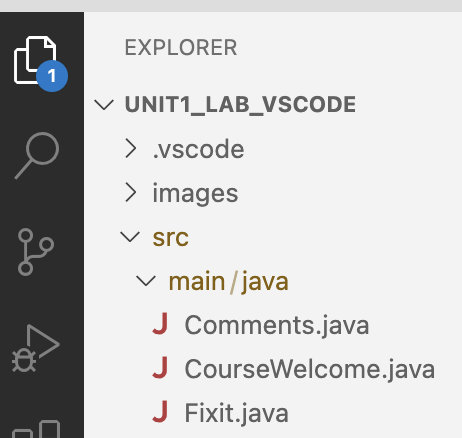

## Task 1 - CourseWelcome

Let's examine a simple Java program that prints a greeting. A Java class with a
`main` method represents an executable program.

```java
public class CourseWelcome {
    public static void main(String[] args) {
        System.out.println("Welcome.");
        System.out.println("Let's learn Java!");
    }
}
```

Double-click on `CourseWelcome` in the project view to open the file in the
editor.

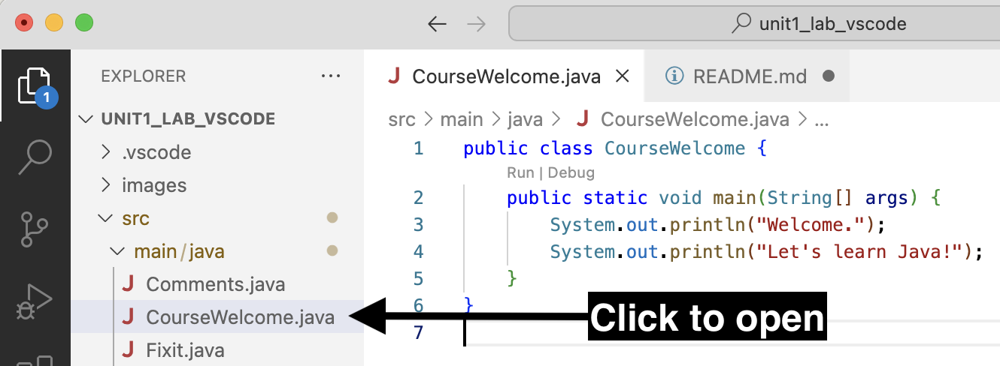

This code defines a Java class called `CourseWelcome`. Inside the class, the
`main` method is implemented, which is the entry point of a Java program. The
`main` method contains two `System.out.println` statements that print the
following text to the console:

```text
Welcome.
Let's learn Java!
```

When the program is executed, these two lines of text will be displayed on the
screen.

### Run CourseWelcome

There are several ways to run the `main` method.

1. Click **Run** above the `main` method.
2. Right-click in the editor window and select **Run Java**.
3. Right-click on `CourseWelcome.java` in the project view and select **Run
   Java**.
4. Select **Run > Run without debugging** from the top menubar.

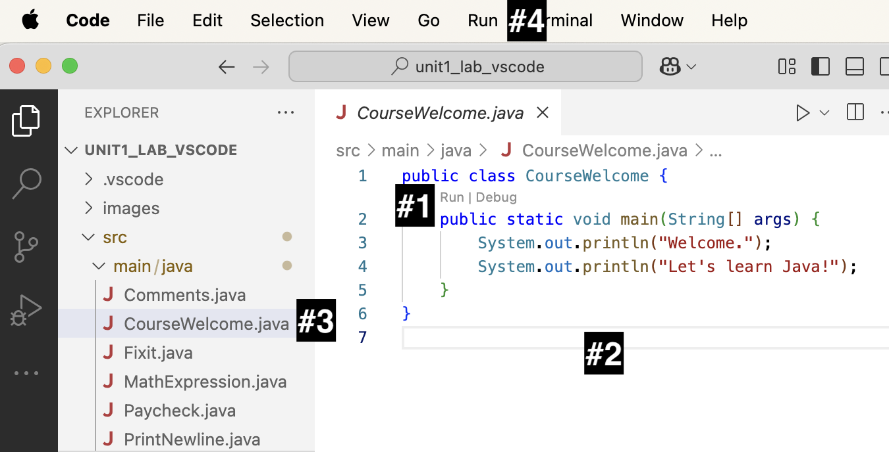

Experiment with the different ways to run the `CourseWelcome` class. Confirm the
following two lines of output are produced.

```text
Welcome.
Let's learn Java!
```

### Run CourseWelcomeTest

Many of the tasks you'll do will involve writing a program to produce some
expected output. For each task, you need to test the program to check the
output. The current code produces the text shown in the **Actual Output** column
below. However, assume the code should produce the text in the **Expected
Output** column.

| Expected Output                           | Actual Output                 |
| ----------------------------------------- | ----------------------------- |
| Welcome to CMCS 115.<br>Let's learn Java! | Welcome.<br>Let's learn Java! |

We'll use a very popular testing framework named Junit to test our code. For
each regular Java class, we use a separate Junit class to test the
functionality.

- Java class `CourseWelcome`
- Junit test class `CourseWelcomeTest`

Expand the test folder in the project view as shown in the screenshot below. The
test folder contains a Junit test class for each regular Java class.

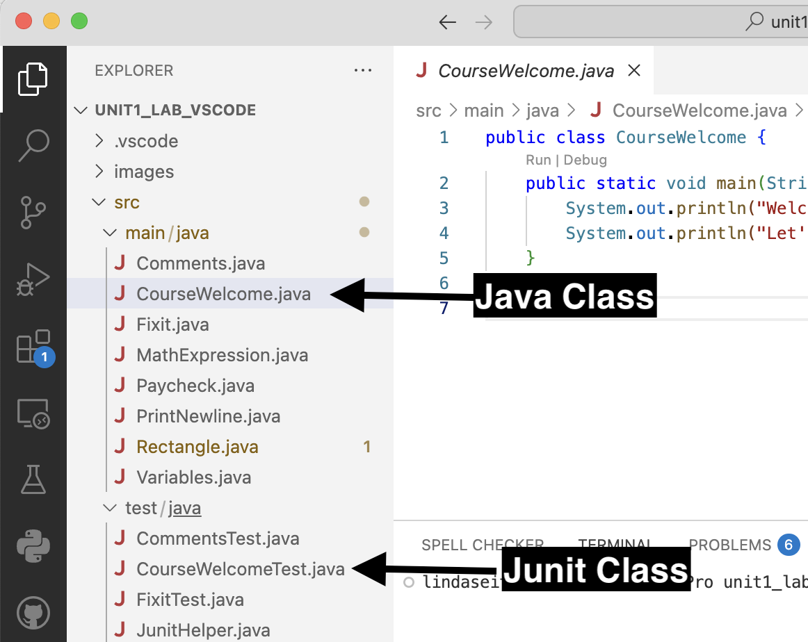

The `CourseWelcomeTest` Junit class has a method that checks the output produced
when the `CourseWelcome` class is executed. Don't worry about understanding the
code in the Junit test class. We'll learn how to write Junit tests in a later
lesson. For now, you'll just run the test to check the result.

1. Right-click on `CourseWelcomeTest` in the project view, then select **Run
   Tests**.<br>
   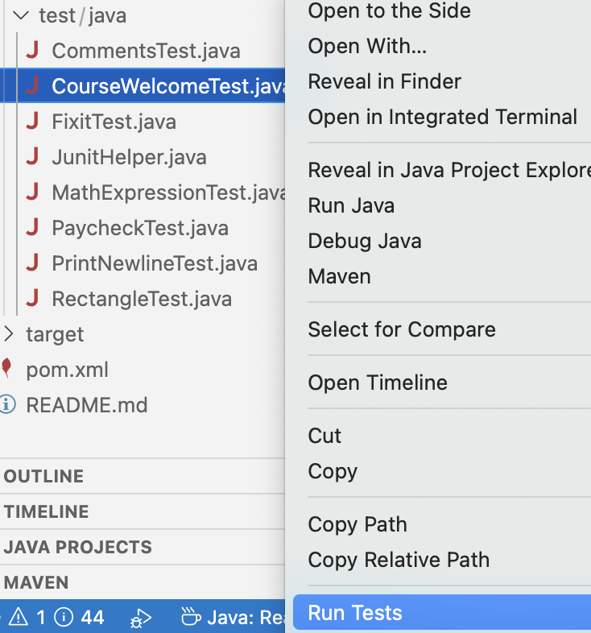

2. The Test Runner view will display a message indicating the test failed (red
   x). Click on the failed test to view a side-by-side comparison highlighting
   the difference between the expected and actual output.<br>
   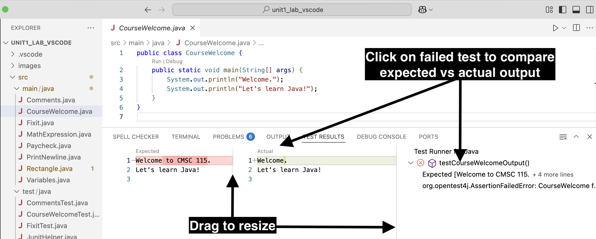

3. Update the `CourseWelcome` class to produce the expected output. The first
   print statement in the `main` method should print the character string
   "Welcome to CMCS 115.".<br>
   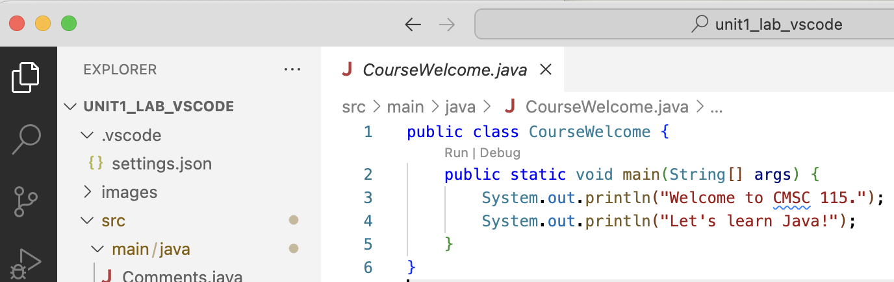

4. Re-run the Junit `CourseWelcomeTest` class and confirm the test passed. You
   should see a green checkmark indicating the test passed.<br>
   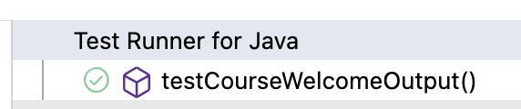

Congratulations on successfully passing your first Java coding task!

## Task 2 - Comments

Java comments can be used to help explain the code. A comment can also prevent
one or more lines of code from executing.

- Line comment: Text following `//` is ignored on the current line.
- Block or multi-line comment: Text between `/*` and `*/` is ignored.

Click on the Java class named `Comments` to open the file in the editor, then
run the program to view the output.

```java
/**
 * Comments class - demonstrate different types of Java comments.
 *
 * @Author first last
 */
public class Comments {
    public static void main(String[] args) {

        System.out.println("apple");

        //System.out.println("orange");

        System.out.println("pear");  //End of line comment

        /*
        System.out.println("lemon");
        System.out.println("banana");
         */

        System.out.println("watermelon");

        System.out.println("peach");
    }
}
```

- A line comment `//` prevents the statement that prints "orange" from
  executing.
- A block comment `/* */` prevents the two statements that print "lemon" and
  "banana" from executing.
- The print statement for "pear" executes because `//` appears _after_ the
  statement, which ends with a semicolon.

| Expected Output                     | Actual Output                        |
| ----------------------------------- | ------------------------------------ |
| apple<br>pear<br>watermelon<br><br> | apple<br>pear<br>watermelon<br>peach |

Notice the expected output does not include "peach".

1. Right-click on the Junit class `CommentsTest` in the project view, then
   select **Run Tests**. You should see a message in the run view indicating the
   test failed (red x). Click to see the difference between the expected and
   actual output.<br>
   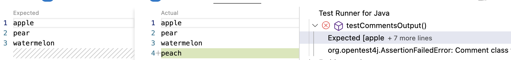

2. Update the `Comments` class to produce the expected output by adding `//` to
   comment out the last print statement (don't delete it!).

```text
     //System.out.println("peach");
```

3. Re-run the Junit class `CommentsTest` to confirm the test passed (green
   checkmark).

### JavaDoc

The `Comments` class contains a special type of block comment before the class
header called a _JavaDoc_ comment. A Javadoc comment has an extra asterisk at
the beginning `/**` and ends with `/`. For example:

```java
/**
 * Comments class - demonstrates different types of Java comments.
 *
 * @Author first last
 */
```

JavaDoc is used to generate documentation in HTML format from Java source code.
We'll learn more about JavaDoc in a later lesson, but it is a good idea to
comment each class and method, and use special tags such as `@Author`.

## Task 3 - Fixit

Open the Java class named `Fixit` in the editor.

```java
public class Fixit {
    public static void main(String[] args) {
        System.out.println("ship");
        //System.out.println("airplane")
        System.out.println("tank");
    }
}
```

| Expected Output          | Actual Output        |
| ------------------------ | -------------------- |
| ship<br>airplane<br>tank | ship<br>tank<br><br> |

Run the program to see the output. The second print statement is commented out,
so the program doesn’t produce the expected result.

In Java, every statement must end with a semicolon. Notice that the first and
third print statements have a semicolon at the end of the line, but the
commented-out second print statement does not.

Remove the comment characters `//` from the second print statement.

```java
System.out.println("airplane")
```

Notice the editor window displays a red warning symbol at the end of the line
where the semicolon should be. If you hover over the error, you'll see a message
about the missing semicolon. If you run the program, you'll see an error message
displayed in the run view. The program can't run because of the missing
semicolon.

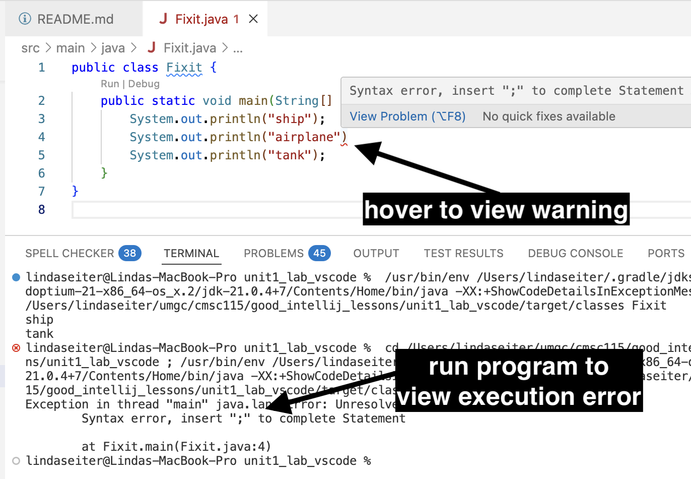

Let's fix the syntax error so the program can execute.

1. Add a semicolon to the end of the print statement to fix the syntax error.
2. Run `Fixit` to see the output.
3. Run the Junit class `FixitTest` and confirm the test passes.

## Task 4 - PrintNewline

Open the Java class named `PrintNewline`.

```java
public class PrintNewline {

    public static void main(String[] args) {
        System.out.println("red ");
        System.out.print("green ");
        System.out.println("blue ");
        System.out.print("pink ");
        System.out.println("yellow");
    }

}
```

- `System.out.println`: Appends a newline character. Subsequent output appears
  on the next line. For example, "red" and "green" are printed on separate lines
  because a newline is added after printing "red".
- `System.out.print` : Does not append a newline character. Subsequent output
  appears on the same line. For instance, "green" and "blue" are printed on the
  same line because no newline is added after printing "green".

| Expected Output                        | Actual Output                              |
| -------------------------------------- | ------------------------------------------ |
| red <br>green blue <br>pink <br>yellow | red <br>green blue <br>pink yellow<br><br> |

Run `PrintNewline` to view the output. In the expected output, "yellow" appears
on a separate line from "pink". Let's fix the program to produce the expected
output:

1. Edit the code so a newline character is appended after printing "pink" (use
   println instead of print).
2. Run `PrintNewline` to view the output.
3. Run `PrintNewlineTest` to confirm the test passes.

## Task 5 - MathExpression

Open the class named `MathExpression`.

```java
public class MathExpression {
    public static void main(String[] args) {
        System.out.print("2 + 3 * 8 = ");
        System.out.println(2 + 3 * 8);
    }
}
```

A `String` is a sequence of characters surrounded by double quotes. An unquoted
arithmetic expression evaluates to a numeric value.

| Expression      | Value           |
| --------------- | --------------- |
| "2 + 3 \* 8 = " | "2 + 3 \* 8 = " |
| 2 + 3 \* 8      | 26              |

Run `MathExpression` to view the output. Assume we would like to evolve the
program to produce the expected output shown below:

| Expected Output   | Actual Output   |
| ----------------- | --------------- |
| (2 + 3) \* 8 = 40 | 2 + 3 \* 8 = 26 |

1. Adjust the 2 print statements to produce the expected output. You need to add
   parenthesis in both the string and the math expression to force `+` to be
   performed before `*`.
2. Run `MathExpression` to confirm the expected output.
3. Run `MathExpressionTest` to confirm the test passes.

## Task 6 - Variables

Open the class named `Variables`.

```java
public class Variables {
    public static void main(String[] args) {
        String name = "Silas";
        System.out.println("Hello " + name);

        int age = 28;
        System.out.println("You are " + age + " years old.");

        //TODO: Declare and assign gpa to 3.8.  Print a message showing the gpa.

    }
}
```

Run the program to view the output.

```text
Hello Silas
You are 28 years old.
```

- A **variable** is a name associated with a memory location.
- A **variable declaration** allocates memory to store a value of a specified
  type.
- A **variable assignment** stores a value in the variable's memory location.

Java requires a variable to be declared **before** it can be assigned a value. A
variable declaration must specify a data type such as `int` or `double` or
`String`, along with the name of the variable. Once a variable is declared, it
can be assigned an initial value. The declaration and initialization can be done
in one statement or two as shown below.

| One Statement                        | Two Statements                                            |
| ------------------------------------ | --------------------------------------------------------- |
| int age = 28; //declare & initialize | int age; &nbsp; &nbsp;//declare<br>age = 28; //initialize |

If you look carefully at the output, you'll see each print statement displays
the text contained in the double quotes, followed by the value assigned to the
corresponding variable. The plus character `+` is used to concatenate the quoted
string and the variable value.

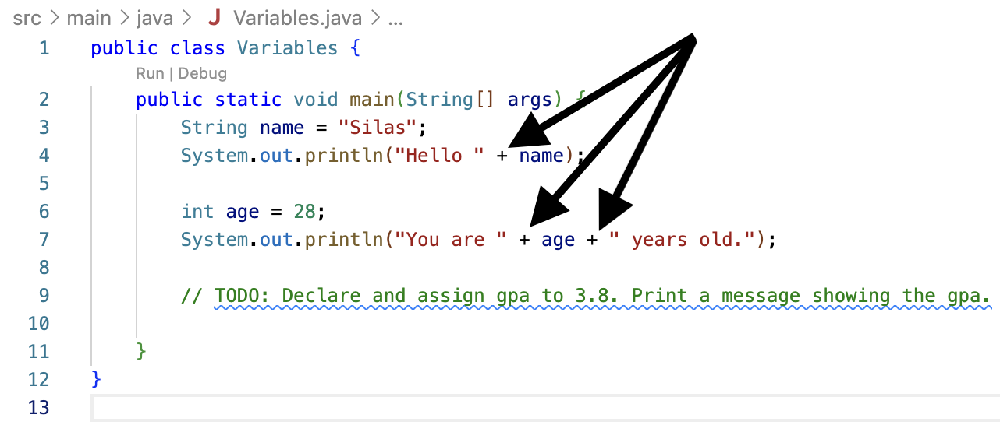

1. Update the `Variables` class to declare a third variable named `gpa` whose
   type is double and value is 3.8. Add a print statement to display the value.
   <br>

```java
        double gpa = 3.8;
        System.out.println("Your gpa is " + gpa);
```

2. Run `Variables` to confirm the output.<br>

```text
Hello Silas
You are 28 years old.
Your gpa is 3.8
```

3. Run `VariablesTest` to confirm the test passes.

## Task 7 - Paycheck

Open the class named `Paycheck`.

```java
/**
 * Paycheck class - debugging sample to demonstrate variables in memory
 * @author First Last
 */
public class Paycheck {
    public static void main(String[] args) {
        //Declare and initialize variables
        double hourlyRate = 18.25;
        int hoursWorked = 35;
        double pay = hoursWorked * hourlyRate;

        //Print initial values
        System.out.println("Week#1 hours: " + hoursWorked + " rate: $" + hourlyRate + " pay: $" + pay);

        //Assign hoursWorked to 39, recalculate pay
        hoursWorked = 39;
        pay = hoursWorked * hourlyRate;

        //Print updated values
        System.out.println("Week#2 hours: " + hoursWorked + " rate: $" + hourlyRate + " pay: $" + pay);

        //TODO: Week 3 - Assign hoursWorked to 27, increase hourlyRate by 0.50, recalculate pay

        //TODO: Print updated values

    }
}
```

Execute the program and view the output.

```text
Week#1 hours: 35 rate: $18.25 pay: $638.75
Week#2 hours: 39 rate: $18.25 pay: $711.75
```

A variable is declared only once within a block such as a method body. However,
it can be assigned a value several times.

Let's use the debugger to step through the program one line of code at a time.
Debugging shows how variables are declared, initialized, and updated in memory.

<table>

<tr>
<td>
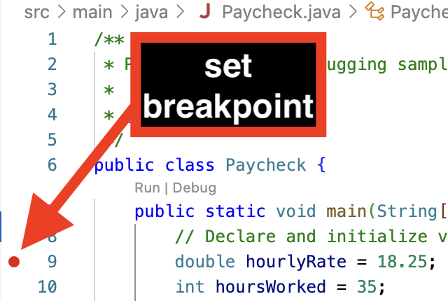
</td>
<td>
Set a breakpoint at line 9 by clicking in the gutter to the left of the line number.<br>  A breakpoint is indicated by a red circle.  You can remove a breakpoint by clicking on it again.
</td>
</tr>

<tr>
<td>
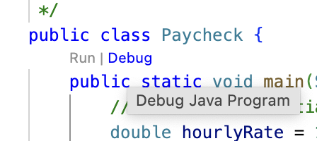
</td>
<td>
There are several ways to start the debugger:<br>
- Select <b>Debug</b> above the `main` method.<br> 
- Right-click in the code editor, then select <b>Debug Java</b>.<br>
- Right-click on Paycheck.java, then select <b>Debug Java</b>.<br>
- Select <b>Run > Start Debugging</b> from the main menubar.<br>
</td>
</tr>
</table>

The main method is called and stops execution at the breakpoint, i.e. line 9. If
the program doesn't stop at line 9, you might not have set the breakpoint.

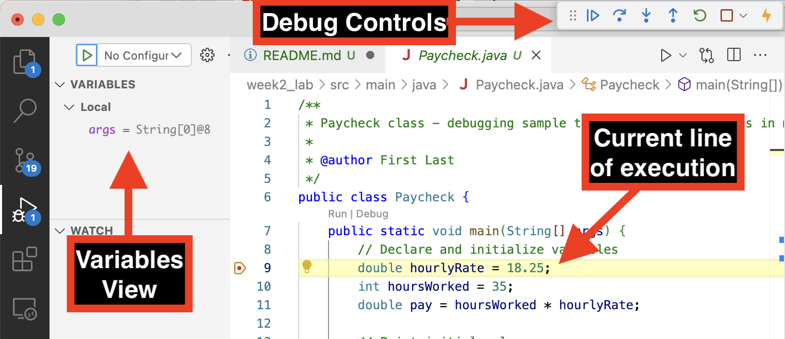

- Line 9 is highlighted, indicating the current line of execution.
- The **variables view** will display variables stored in memory.
- The run view displays new buttons to control the debugging session.

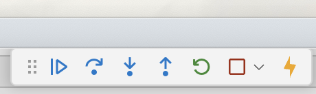

Let's use the "Step Over" button to execute one line of code at a time and
observe how each statement impacts the variables stored in memory.

<table>

<tr>
<th>
Step Over or F8
</th>
<th>
Line Of Execution
</th>
<th>
Variables View
</th>
</tr>

<tr>
<td>

</td>
<td>
<code>double hourlyRate = 18.25;</code>
</td>
<td>
Memory for <code>hourlyRate</code> is allocated and initialized.<br>
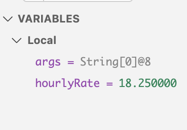
</td>
</tr>

<tr>
<td>
</td>
<td>
<code>int hoursWorked = 35;</code></td>
<td>
Memory for <code>hoursWorked</code> is allocated and initialized. <br>
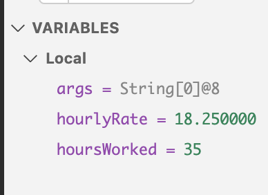
</td>
</tr>

<tr>
<td>
</td>
<td>
<code>double pay = hoursWorked * hourlyRate;</code></td>
<td>
Memory for <code>pay</code> is allocated and calculated using the values stored in <code>hoursWorked</code> and <code>hourlyRate</code>.<br>
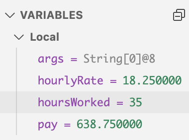
</td>
</tr>

<tr>
<td>
</td>
<td>
<code>System.out.println("Week#1 hours: " + hoursWorked + " rate: $" + hourlyRate + " pay: $" + pay);</code></td>
<td>
Click the console tab to view the printed output.
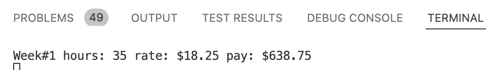
</td>
</tr>

<tr>
<td>
</td>
<td>
<code>hoursWorked = 39;</code></td>
<td>
<code>hoursWorked</code> is reassigned to a new value.
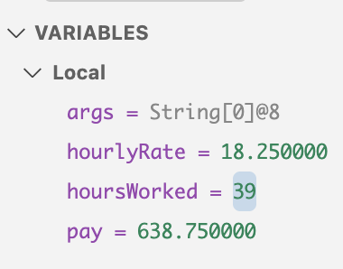
</td>
</tr>

<tr>
<td>
</td>
<td>
<code>pay = hoursWorked * hourlyRate;</code></td>
<td>
<code>pay</code> is recalculated.
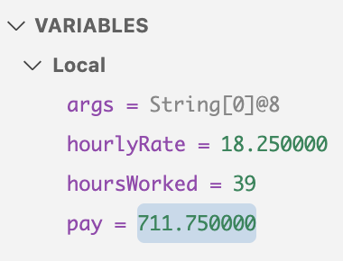
</td>
</tr>

<tr>
<td>
</td>
<td>
<code>
System.out.println("Week#2 hours: " + hoursWorked + " rate: $" + hourlyRate + " pay: $" + pay);</code></td>
<td>
Click the console tab to view the output. 
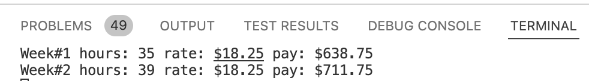
</td>
</tr>

<tr>
<td>

</td>
<td colspan="2">
You've reached the end of the main method.  Press the red square to terminate the debug session.
</td>
</tr>

</table>

Now that you've seen how variables are initialized and updated in memory, update
the `main` method as follows:

- Add statements to update `hoursWorked` and `hourlyRate` and recalculate `pay`
  for week#3.
- Print the updated variable values. The expected output is displayed below:

```text
Week#1 hours: 35 rate: $18.25 pay: $638.75
Week#2 hours: 39 rate: $18.25 pay: $711.75
Week#3 hours: 27 rate: $18.75 pay: $506.25
```

- Run `Paycheck` and confirm the expected output. Use the debugger to find and
  fix any errors.
- Run `PaycheckTest` to confirm the tests passed.

Aside from visualizing variables in memory, you can use the debugger to step
through your code to find logic errors.

Debugging is **one of the most useful skills** you can acquire as a software
developer!

## Task 8 - Rectangle

Open the class named `Rectangle`.

```java
import java.util.Scanner;

/**
 * Rectangle class - demonstrate initializing variables from console input
 *
 * @author First Last
 */
public class Rectangle {
    public static void main(String[] args) {
        // Declare and initialize Scanner for reading input from console
        Scanner input = new Scanner(System.in);

        // Prompt for length and width
        System.out.print("Enter length and width: ");

        // Declare width and initialize from the console input
        double length = input.nextDouble();

        // Declare width and initialize from the console input
        double width = input.nextDouble();

        // TODO: Declare area and initialize using width and height

        // TODO: Update to also print area
        System.out.println("length=" + length + " width=" + width);

    }
}
```

The program uses a `Scanner` to read user input and initialize the `length` and
`width` variables of a rectangle.

When you run the `Rectangle` class, the program displays the prompt "Enter
length and width: " and then waits until you enter two double values in the
terminal window.

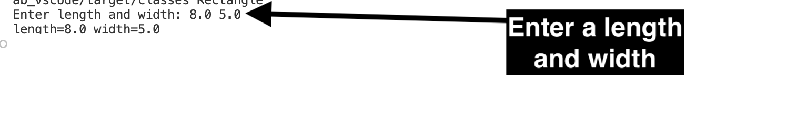

The program should calculate and print the length, width, and area of the
rectangle. However, it only prints the length and width.

| Expected Input/Output                                                    | Actual Input/Output                                            |
| ------------------------------------------------------------------------ | -------------------------------------------------------------- |
| Enter length and width: <b>4.5 3.0</b><br>length=4.5 width=3.0 area=13.5 | Enter length and width: <b>4.5 3.0</b><br>length=4.5 width=3.0 |

If you run the Junit test class `RectangleTest`, you'll see several tests fail.
Each test provides the main method with different input values for `length` and
`width`. Click on any failed test to compare the expected versus actual output.
Notice the area is missing in the output.

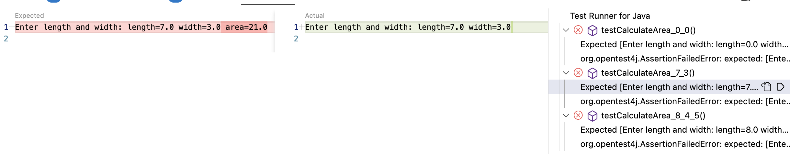

1. Update the `main` method to declare a double variable named `area`. Calculate
   the area using the width and length that the user provided as input. Update
   the print statement to display the length, width, and area as shown in the
   expected output.<br>
2. Run `Rectangle` several times, passing different input values for length and
   width.
3. Run the Junit `RectangleTest` class to confirm the tests pass.

| Sample Run#1                                                             | Sample Run#2                                                                   |
| ------------------------------------------------------------------------ | ------------------------------------------------------------------------------ |
| Enter length and width: <b>4.5 3.0</b><br>length=4.5 width=3.0 area=13.5 | Enter length and width: <b>10.25 2.5</b><br>length=10.25 width=2.5 area=25.625 |

## Submission Requirements

TBD

## Resources

TBD

<style>
      th,td {
         border: 1px solid black;
         padding: 5px;
      }
</style>
