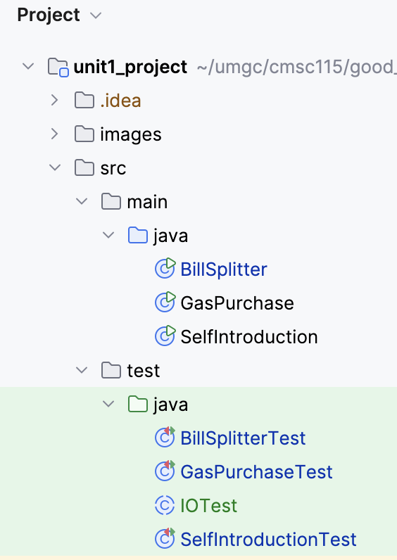
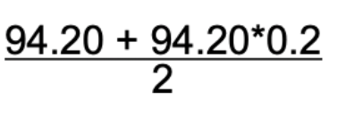

# CMSC 115 Unit 1 Programming Projects

## Introduction

In this assignment, you will complete three programming tasks
to practice essential Java skills such as printing output,
performing arithmetic operations, taking user input, and
using JavaDocs for documentation. These tasks will help
solidify your understanding of basic programming concepts
that are crucial for developing more complex software solutions.

You will be tasked with writing Java programs for the following scenarios:

1. **SelfIntroduction**: This task will introduce you to printing multiple lines of output using `System.out.println()`. You will create a simple self-introduction program that produces at least four lines of text.

2. **BillSplitter**: This program will challenge you to work with mathematical expressions and operator precedence. You will fix errors in the code to calculate the amount each person owes when splitting a bill with a 20% tip.

3. **GasPurchase**: In this task, you will take user input for gallons of gas purchased and the price per gallon, then calculate the total cost. This exercise will help you practice working with input/output and basic arithmetic operations in Java.

By completing these tasks, you will develop proficiency in basic Java syntax and functionality, while also gaining experience in using JUnit tests to verify the correctness of your code.

## Project Structure

Expand the `unit1_project > src` folder to view the Java classes and associated Junit tests.



## Task 1 - SelfIntroduction

Open the `SelfIntroduction` class to view the file in the editor.

```java
/**
 * SelfIntroduction class demonstrates at least 4 print statements.
 * This class is intended to show how to use the System.out.println method 
 * for printing various self-introduction details.
 *
 * @author First Last
 */
public class SelfIntroduction {
    public static void main(String[] args) {
        // TODO: Add 4+ print statements to introduce yourself

    }
}
```

The `SelfIntroduction` class contains a `main` method with an empty block for
the method body. The class also contains a JavaDoc comment before the class
header.

1. Edit the JavaDoc comment to update the author tag with your first and last
   name.
2. Edit the `main` method to add print statements to introduce yourself. The
   program should produce **at least 4** lines of output.
3. Run `SelfIntroduction` to confirm your program prints at least 4 lines of
   output. For example:<br>
   ```text
   My name is Spongebob.
   I am majoring in Comedic Arts.
   I live in a pineapple at the bottom of the sea.
   I love to laugh!
   ```
4. Run the Junit class `SelfIntroductionTest` to confirm the test passes.


## Task 2 - BillSplitter

Open the  `BillSplitter` class in the editor.

```java
/**
 * BillSplitter - demonstrates printing a math expression and order of operations.
 * This class calculates the amount each person owes when a bill of $94.20 
 * is split between two people with a 20% tax applied.
 * The calculation takes into account the correct order of operations.
 *
 * @author First Last
 */
public class BillSplitter {
    public static void main(String[] args) {
        System.out.print("Each person owes: ");
        System.out.println("94.20 + 94.20 * 0.2 / 2"); // TODO: Fix the errors
    }
}
```

Assume 2 people are splitting a restaurant bill for $94.20 plus a 20% tip. The
program should calculate and print each person's share of the bill using the
formula shown below.



Run the program to view the output. The second print statement has a couple of
errors that prevent the program from producing the expected output.
1. Remove the double quotes so the value of the expression is printed.
2. Fix the error in the arithmetic expression so the correct value is produced.

| Expected Output         | Actual Output                              |
| ----------------------- | ------------------------------------------ |
| Each person owes: 56.52 | Each person owes: 94.20 + 94.20 \* 0.2 / 2 |

1. Edit the JavaDoc comment to update the author tag with your first and last
   name.
2. Edit the second print statement to fix the errors. The math expression should
   be corrected and its value printed.
3. Run `BillSplitter` to confirm your program produces the correct output.
4. Run the Junit `BillSplitterTest` class to confirm the test passes.

HINT: Recall operator precedence and the default order of operations:

1. Parentheses
2. Multiplication and Division
3. Addition and Subtraction

## Task 3

Open the `GasPurchase` class in the editor.

```java
import java.util.Scanner;

/**
 * GasPurchase class - demonstrates initializing variables from console input.
 * This class prompts the user for input regarding the number of gallons 
 * purchased and the price per gallon, calculates the total cost, and 
 * then prints the total amount owed.
 *
 * @author First Last
 */
public class GasPurchase {
    public static void main(String[] args) {
        Scanner input = new Scanner(System.in);

        // TODO:

    }
}
```

1. Edit the JavaDoc comment to update the author tag with your first and last
   name.
2. Edit the `main` method to prompt the user to enter the amount of gallons and
   the price per gallon of gas. Declare appropriate variables to store the user
   input, then calculate and print the cost as shown in the sample runs below.
3. Run `GasPurchase` several times and confirm the expected output given the
   input values as shown in the sample runs.

| Sample Run#1                                                            | Sample Run#2                                                         |
| ----------------------------------------------------------------------- | -------------------------------------------------------------------- |
| Enter gallons and price per gallon: <b>12.5 3.50</b><br> You owe $43.75 | Enter gallons and price per gallon: <b>8.0 3.75</b><br>You owe $30.0 |

5. Run the Junit `GasPurchaseTest` class to confirm the tests pass.


## Submit Your Solution

TBD

<style>
   th,td {
      border: 1px solid black;
      padding: 5px;
   }
</style>
