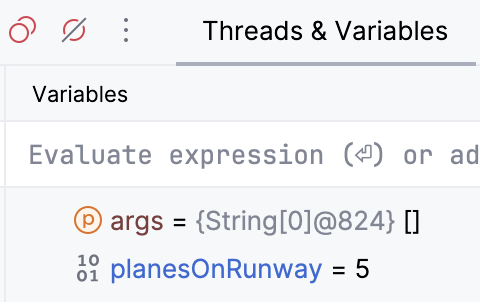

# CMSC 115 Unit 2 Lab

## Learning Objectives

- Use mathematical and augmented assignment operators to perform operations on variables.
- Convert between different numeric types, such as casting a `double` to an `int`, and applying rounding methods to numeric values.
- Run JUnit tests to verify the correctness of a Java program.
- Identify and fix syntax errors in code, such as incorrect variable declarations or operator usage.
- Use a debugger to step through code and identify logic errors in programs.


## Introduction

In this unit, we will explore some of the fundamental concepts in Java programming
that will help you improve the readability, efficiency, and correctness
of your code. These include augmented assignment operators, numeric conversions,
and debugging techniques. You will also learn how to use JUnit for testing,
which is essential for ensuring your code performs as expected. By the end of this lab,
you should have a solid understanding of these concepts and be able to apply them
to your Java programs effectively.

## Setup

TODO: Instructions on how to configure debugger to prevent stepping into java.\*
methods, etc.

## Task 1 - JavaFacts

**Objective**: Review how to use JUnit to check if the code produces the correct output.

Let's review how to run a Junit test to check code functionality.

Open the `JavaFacts` class in the editor.

```java
public class JavaFacts {

	public static void main(String[] args) {
		System.out.println("Java was initially named Oak.");
		System.out.println("Java is a language.");
	}

}
```

`JavaFacts` should produce the expected output displayed below. However, the
actual output produced by the current code differs from the expected output.

| Expected Output                                                       | Actual Output                                        |
| --------------------------------------------------------------------- | ---------------------------------------------------- |
| Java was initially named Oak.<br>Java is an object-oriented language. | Java was initially named Oak.<br>Java is a language. |

1. Run the Junit `JavaFactsTest` class and confirm the test fails.  Recall you can view the differences between the expected and actual output.
2. Edit the second print statement in the `main` method in `JavaFacts` to produce the expected output.
3. Re-run the `JavaFactsTest` class and confirm your solution passes the Junit test.

## Task 2 - PizzaShares

**Objective**: Use division and remainder operators to compute the number of slices per person and remaining slices.

Open the `PizzaShares` class in the editor.

```java
import java.util.Scanner;

/**
 * PizzaShares class demonstrates user input, along with division and remainder
 * operators
 *
 * @author First Last
 */
public class PizzaShares {
   public static void main(String[] args) {
      // Declare and initialize Scanner to read user input
      Scanner input = new Scanner(System.in);

      // Prompt for number of pizza slices and number of people
      System.out.print("Enter #slices and #people: ");
      int totalSlices = input.nextInt();
      int people = input.nextInt();

      // Compute number of slices per person
      int slicesPerPerson = totalSlices / people;

      System.out.println("Each person gets " + slicesPerPerson + " slices.");

      // TODO: Compute and print number of slices remaining

   }

}
```

The program uses a `Scanner` to read user input and initialize the `totalSlices`
and `people` variables. The number of whole slices per person is then computed and stored in 
`slicesPerPerson`.

Run the `PizzaShares` class and enter the sample input:

<table>
<tr>
<th>Sample Run</th>
</tr>
<tr>
<td>Enter #slices and #people: <b>24 10</b><br>
Each person gets 2 slices.</td>
</tr>
</table>

Given 24 slices and 10 people, each person gets 2 slices. How many slices are
leftover?

<table>
<tr><td>Operator</td><td>Meaning</td><td>Expression</td><td>Value</td></tr>
<tr><td>+</td><td>addition</td><td>5+3</td><td>8</td></tr>
<tr><td>-</td><td>subtraction</td><td>8-2</td><td>6</td></tr>
<tr><td>*</td><td>multiplication</td><td>4*5</td><td>20</td> </tr>
<tr><td>/</td><td>division</td><td>17/3</td><td>5</td> </tr>
<tr><td>%</td><td>remainder</td><td>17%3</td><td>2</td> </tr>
</table>

1. Modify the `main` method to use Java's modulo (remainder) operator to compute the remaining slices, storing the result in a new variable called `slicesRemaining`. Then, print the value as shown in the sample runs below.
2. Run `PizzaShares` multiple times with different input values and verify that the output matches the expected results.

<table>
<tr>
<th>Sample Run#1</th><th>Sample Run#2</th>
</tr>
<tr>
<td>Enter #slices and #people: <b>24 10</b><br>
Each person gets 2 slices.<br>
There are 4 slices remaining.</td>
<td>Enter #slices and #people: <b>12 4</b><br>
Each person gets 3 slices.<br>
There are 0 slices remaining.</td>
</tr>
</table>

3. Run the `PizzaSharesTest` class to confirm your solution passes the Junit tests. Note
   there are two test methods, each checking a different set of inputs. You'll
   should see multiple test results displayed.

## Task 3 - StudentInfo

**Objective**: Fix an error where a variable is redeclared.

In Java, when you declare a variable, you define its type and assign it a name.
After the variable is declared, its value can be changed multiple times within
the same scope, such as inside a method, loop, or block of code. We'll explore
loops and blocks in more detail later. For now, let's look at an example where
a variable is declared and initialized in the `main` method, and then mistakenly
declared a second time within the same method.

Open `StudentInfo` in the editor and run the program. 

```java
/**
 * StudentInfo class demonstrates an error in redeclaring a variable.
 *
 * @author First Last
 */
public class StudentInfo {

   public static void main(String[] args) {
      // Variable declaration and initialization
      double gpa = 3.8;

      // Variable declaration
      int age;
      // Variable initialization
      age = 28;

      // Print initial values
      System.out.println("Age: " + age + " gpa: " + gpa);

      // Update age to 29
      age = 29;

      // TODO: Fix the error and update gpa to 4.0.
      // double gpa = 4.0;

      // Print updated values
      System.out.println("Age: " + age + " gpa: " + gpa);

   }

}
```

<table>
<tr>
<th>Expected Output</th>
<th>Actual Output</th>
</tr>
<tr>
<td>Age: 28 gpa: 3.8<br>
Age: 29 gpa: 4.0</td>
<td>Age: 28 gpa: 3.8<br>
Age: 29 gpa: 3.8</td>
</tr>
</table>

After updating `age` to 29, the code should update `gpa` to 4.0. The line to
reassign `gpa` to 4.0 is currently commented out.
```java
// double gpa = 4.0;
```

1. Remove the comment character before `double gpa = 4.0;`
2. The variable <code>gpa</code> is now underlined in red to indicate an error. Hover the mouse over the error to see a message indicating the variable was already declared (see line 10).


3. Try to run the program. It crashes due to the duplicate variable declaration.

Let's fix the error. Line 24 should assign `gpa` to 4.0 **without** re-declaring the variable.

1. Remove the type `double` to prevent a duplicate variable
   declaration. The compiler error should go away.
   ```java
   gpa = 4.0;
   ```
2. Run `StudentInfo` to view the output.
3. Run `StudentInfoTest` to confirm your solution passes the Junit test.

To summarize, you declare a variable only once in the `main` method by specifying
its name and type. If you want to assign a new value to the variable later,
you don’t need to specify the type again.

## Task 4

**Objective**: Demonstrate the use of augmented assignment operators to update passenger counts at various bus stops.

Java has increment and decrement operators:

<table>
<tr><td>Operator</td><td>Expression</td><td>Equivalent</td></tr>
<tr><td>++</td><td>x++</td><td>x = x + 1</td></tr>
<tr><td>--</td><td>x--</td><td>x = x - 1</td></tr>
</table>

Java also supports augmented assignment operators:

<table>
<tr><td>Operator</td><td>Expression</td><td>Equivalent</td></tr>
<tr><td>+=</td><td>x += 5</td><td>x = x + 5</td></tr>
<tr><td>-=</td><td>x -= 5</td><td>x = x - 5</td></tr>
<tr><td>*=</td><td>x *= 5</td><td>x = x * 5</td> </tr>
<tr><td>/=</td><td>x /= 5</td><td>x = x / 5</td> </tr>
<tr><td>%=</td><td>x %= 5</td><td>x = x % 5</td> </tr>
</table>

Open  `BusRoute` in the editor, then run the program to
view the output.

```java
/**
 * BusRoute class demonstrates augmented assignment operators and increment operator.
 * @author First Last
 */
public class BusRoute {

	public static void main(String[] args) {
		int passengers = 0;
		int busStop = 0;
		System.out.println("Bus begins its route");

		//first stop, 8 people get on (addition assignment operator)
		busStop++;
		System.out.println("8 passengers get on at stop#" + busStop);
		passengers += 8;
		System.out.println("Departing stop#" + busStop + " with " + passengers + " passengers");

		//next stop, 2 get off (subtraction assignment operator)
		busStop++;
		System.out.println("2 passengers get off at stop#" + busStop);
		passengers -= 2;
		System.out.println("Departing stop#" + busStop + " with " + passengers + " passengers");

		//TODO: next stop, half the passengers get off (use division assignment operator)

		//TODO: next stop, the number of passengers triples (use multiplication assignment operator)

	}
}
```

The program uses the increment operator `++` along with augmented assignment
operators `+=` and `-=` to update `busStop` and `passengers`.

| Expected Output                                                                                                                                                                                                                                                                                                                        | Actual Output                                                                                                                                                                               |
| -------------------------------------------------------------------------------------------------------------------------------------------------------------------------------------------------------------------------------------------------------------------------------------------------------------------------------------- | ------------------------------------------------------------------------------------------------------------------------------------------------------------------------------------------- |
| Bus begins its route<br>8 passengers get on at stop#1<br>Departing stop#1 with 8 passengers<br>2 passengers get off at stop#2<br>Departing stop#2 with 6 passengers<br>Half the passengers get off at stop#3<br>Departing stop#3 with 3 passengers<br>The number of passengers triples at stop#4<br>Departing stop#4 with 9 passengers | Bus begins its route<br>8 passengers get on at stop#1<br>Departing stop#1 with 8 passengers<br>2 passengers get off at stop#2<br>Departing stop#2 with 6 passengers<br> <br> <br> <br> <br> |

1. Update `BusRoute` to add two more bus stops. Use the appropriate
   augmented assignment operators to adjust the passenger count.
   - Half the passengers get off at the 3rd stop.
   - The number of passengers triples at the 4th stop.
2. Run `BusRoute` to view the output.
3. Run `BusRouteTest` to confirm your solution passes the Junit tests.

## Task 5 - DebugIt

**Objective**: Use the debugger to identify and fix logic errors involving assignment operators.

Open the `DebugIt` class in the editor, then run the program to
view the output.

```java
/**
 * DebugIt class demonstrates common operator errors.
 *
 * @author First Last
 */
public class DebugIt {

   // TODO: Fix the operator errors
   public static void main(String[] args) {
      int planesOnRunway = 2;

      // 5 planes land on runway, increase planesOnRunway by 5
      planesOnRunway=+5; // expected value: 7
      // 3 planes take off, decrease planesOnRunway by 3
      planesOnRunway=-3; // expected value: 4

      System.out.println("Planes on runway = " + planesOnRunway);
   }
}
```

The program has a subtle but common error that prevents it from producing the
expected output:

| Expected Output      | Actual Output         |
| -------------------- | --------------------- |
| Planes on runway = 4 | Planes on runway = -3 |

Let's use the debugger to execute each line and view the variables in memory.

<table>

<tr>
<td>

</td>
<td>
Set a breakpoint at line 10, the first executable line of the main method.<br><br>Start the debugger by right-clicking on the class and choose <b>Debug DebugIt.main()</b>.
</td>
</tr>

<tr>
<td>

</td>
<td>
The main method is called and stops execution at the breakpoint.
</td>
</tr>
</table>

We'll find the bug using the "step over" button to execute one line of code at a
time and view the variable in memory.

<table>

<tr>
<th>
Step Over
</th>
<th>
Current line
</th>
<th>
Variables View
</th>
</tr>

<tr>
<td>

</td>
<td>
<code>int planesOnRunway = 2;</code>
</td>
<td>

</td>
</tr>

<tr>
<td>
</td>
<td>
<code>planesOnRunway=+5;</code></td>
<td>

<br>
<br>
The variable should be increased by 5, resulting in the value 7, but it is assigned to 5.
<br><br>
The statement has a logic error.
</td>
</tr>

<tr>
<td>
</td>
<td>
<code>planesOnRunway=-3;</code></td>
<td>

<br>
<br>
The variable should be decreased by 3, resulting in the value 4, but it is assigned to -3.
<br><br>
The statement has a logic error.
</td>
</tr>

<tr>
<td>
</td>
<td>
<code>System.out.println("Planes on runway = " + planesOnRunway);</code></td>
<td>
Click the console tab to view the actual output, which does not match the expected output.
</td>
</tr>

<tr>
<td>

</td>
<td colspan="2">
We've reached the end of the main method.  Press the red square to terminate the debug session.
</td>
</tr>

</table>

This example demonstrates a common error with augmented assignment operators.

<table>

<tr>
<th>
Current Incorrect Code
</th>
<th>
Equivalent Code
</th>
</tr>

<tr>
<td>
<code>planesOnRunway=+5;</code>
</td>
<td>
<code>planesOnRunway = +5;</code>
<br><br>Assign to positive 5.
</td>
</tr>

<tr>
<td>
<code>planesOnRunway=-3;</code>
</td>
<td>
<code>planesOnRunway = -3;</code>
<br><br>Assign to negative 3.
</td>
</tr>

</table>

Augmented assignment operators requires the math operator to come **before** the
equal sign, not after it!

<table>
<tr><td>Operator</td><td>Expression</td><td>Equivalent</td></tr>
<tr><td>+=</td><td>x += 5</td><td>x = x + 5</td></tr>
<tr><td>-=</td><td>x -= 5</td><td>x = x - 5</td></tr>
<tr><td>*=</td><td>x *= 5</td><td>x = x * 5</td> </tr>
<tr><td>/=</td><td>x /= 5</td><td>x = x / 5</td> </tr>
<tr><td>%=</td><td>x %/ 5</td><td>x = x % 5</td> </tr>
</table>

1. Fix `DebugIt` to use the correct augmented assignment operators to
   update `planesOnRunway`.
2. Run `DebugIt` to confirm the expected output.
3. Run `DebugItTest` to confirm the Junit tests pass.

Try to remember this error, it is a very common mistake!

## Task 6 - Rounding

**Objective**: Perform numeric conversions and rounding using the int type and various rounding methods.

Open the `Rounding` class  in the editor.

```java
import java.util.Scanner;

/**
 * Rounding class demonstrates numeric conversion and rounding.
 * (1) Cast a double to an int
 * (2) Round a double to nearest integer
 * (3) Truncate a double to 3 digits after the decimal point
 * (4) TODO: Round a double to 3 digits after the decimal point
 * @author First Last
 */

public class Rounding {

	public static void main(String[] args) {
		Scanner input = new Scanner(System.in);

		System.out.print("Enter number: " );
		double num = input.nextDouble();

		System.out.println("Cast as int: " + (int)num);
		System.out.println();

		System.out.println("Round to nearest int");
		System.out.println("Original: \t"  	+ num);
		System.out.println("Add 0.5:\t" 	+ (num + 0.5));
		System.out.println("Cast as int:\t" + (int) (num + 0.5));
		System.out.println();

		System.out.println("Truncate to 3 digits after the decimal point");
		System.out.println("Original:\t\t"      		+ num);
		System.out.println("Move . 3 digits right:\t" 	+ num * 1000 );
		System.out.println("Cast as int\t\t"        	+ (int) (num * 1000));
		System.out.println("Move . 3 digits left:\t"  	+ (int) (num * 1000 ) / 1000.0);
		System.out.println();

		//TODO
		System.out.println("Round to 3 digits after the decimal point");

	}

}
```

Run the program, passing the bold value as input:

<table>
<tr>
<th>Sample Run#1</th>
<th>Sample Run#2</th>
</tr>
<tr>
<td>Enter number: <b>1.9247</b><br>
Cast as int: 1<br>
<br>
Round to nearest int<br>
Original: 	1.9247<br>
Add 0.5:	2.4247<br>
Cast as int:	2<br>
<br>
Truncate to 3 digits after the decimal point<br>
Original:		1.9247<br>
Move . 3 digits right:	1924.7<br>
Cast as int		1924<br>
Move . 3 digits left:	1.924<br>
<br>
Round to 3 digits after the decimal point
</td>
<td>Enter number: <b>3.2984</b><br>
Cast as int: 3<br>
<br>
Round to nearest int<br>
Original: 	3.2984<br>
Add 0.5:	3.7984<br>
Cast as int:	3<br>
<br>
Truncate to 3 digits after the decimal point<br>
Original:		3.2984<br>
Move . 3 digits right:	3298.4<br>
Cast as int		3298<br>
Move . 3 digits left:	3.298<br>
<br>
Round to 3 digits after the decimal point

</tr>
</table>

Casting converts a value in one data type to another:

<table>

<tr>
<th>
Expression
</th>
<th>
Value
</th>
</tr>

<tr>
<td>
(int)5.274
</td>
<td>
5
</td>
</tr>

<tr>
<td>
(double)3
</td>
<td>
3.0
</td>
</tr>

</table>

We can round a double to the nearest integer by adding 0.5 and then casting the
result as an int. If the fractional part is less than 0.5, the number rounds
down otherwise it rounds up:

<table>

<tr>
<th>
Expression
</th>
<th>
Value
</th>
</tr>

<tr>
<td>
(int)(7.3 + 0.5)
</td>
<td>
7
</td>
</tr>

<tr>
<td>
(int)(7.6 + 0.5)
</td>
<td>
8
</td>
</tr>

</table>

We can truncate a number to N digits after the decimal point using the following
expression

<table>

<tr>
<th>
Expression
</th>
<th>
Truncate digits
</th>
</tr>

<tr>
<td>
(int) (num * 10 ) / 10.0);
</td>
<td>
1 digit after decimal point
</td>
</tr>

<tr>
<td>
(int) (num * 100 ) / 100.0);
</td>
<td>
2 digits after decimal point
</td>
</tr>

<tr>
<td>
(int) (num * 1000 ) / 1000.0);
</td>
<td>
3 digits after decimal point
</td>
</tr>

</table>

The `Rounding` class shows how to:

1. cast a double as an int
2. round a double to the nearest integer
3. truncate a double to 3 digits after the decimal point.

Your task is to update the `main` method with statements to round the input
value to 3 digits after the decimal point.

1. Update `Rounding` to perform the additional task of rounding the number to 3 digits after the decimal
   point, producing the expected output displayed in the sample runs.
2. Run `Rounding` to confirm the output.
3. Run `RoundingTest` to confirm your solution passes the Junit tests.

<table>
<tr>
<th>Sample Run#1</th>
<th>Sample Run#2</th>
</tr>
<tr>
<td>Enter number: <b>1.9247</b><br>
Cast as int: 1<br>
<br>
Round to nearest int<br>
Original: 	1.9247<br>
Add 0.5:	2.4247<br>
Cast as int:	2<br>
<br>
Truncate to 3 digits after the decimal point<br>
Original:		1.9247<br>
Move . 3 digits right:	1924.7<br>
Cast as int		1924<br>
Move . 3 digits left:	1.924<br>
<br>
Round to 3 digits after the decimal point<br>
Original:		1.9247<br>
Move . 3 digits right:	1924.7<br>
Add 0.5:		1925.2<br>
Cast as int		1925<br>
Move . 3 digits left:	1.925<br>
</td>

<td>Enter number: <b>3.2984</b><br>
Cast as int: 3<br>
<br>
Round to nearest int<br>
Original: 	3.2984<br>
Add 0.5:	3.7984<br>
Cast as int:	3<br>
<br>
Truncate to 3 digits after the decimal point<br>
Original:		3.2984<br>
Move . 3 digits right:	3298.4<br>
Cast as int		3298<br>
Move . 3 digits left:	3.298<br>
<br>
Round to 3 digits after the decimal point<br>
Original:		3.2984<br>
Move . 3 digits right:	3298.4<br>
Add 0.5:		3298.9<br>
Cast as int		3298<br>
Move . 3 digits left:	3.298<br>
</tr>
</table>

## Submit Your Solution

TBD

<style>
table, th, td {
  border: 1px solid black;
  padding: 4px;
  border-collapse: collapse;
  
  }
</style>
