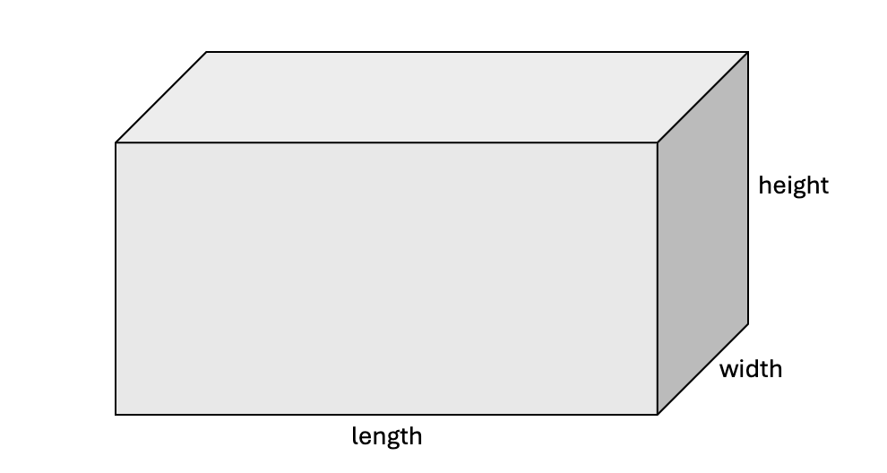

# Unit 5 Project - Paint Estimator

### Introduction

The `PaintEstimator` application calculates the total area of the walls and ceiling of a rectangular room and estimates how many units of paint (liters or gallons) are needed, along with the total cost required to cover those surfaces. The user inputs the room's dimensions (length, width, and height), whether the ceiling should be included in the paint area, and whether the measurements use Metric or Imperial units.

Key features of this application include:

- Validating room dimensions to ensure proper calculations.
- Calculating the surface area of walls and ceiling.
- Estimating the total units of paint based on the surface area.
- Generating a formatted report summarizing the results.
- Combine simple, focused methods to build more complex behavior.

This project demonstrates how to implement static methods, promote modularity, and encourage code reuse by breaking down the problem into smaller, manageable functions.

## Learning Outcomes

1. **Design and Implement Modular Methods**:
   - Design and implement modular, reusable methods that perform specific tasks and reduce code redundancy.
   - Assign a single responsibility to each method to enhance code clarity, maintainability, and testability.

2. **Pass Parameters, Use Local Variables, and Handle Return Values**:
   - Pass values into methods using parameters.
   - Store intermediate results in local variables within methods.
   - Validate parameters to ensure methods operate with valid data, enhancing program reliability.
   - Return values from methods to pass data out.

3. **Method Composition**:
   - Pass return values from one method as parameters to another.
   - Combine simple, specialized methods to build complex functionality, promoting modularity and reusability.

4. **Debug and Comprehend the Call Stack**:
   - Debug a Java program to track the flow of execution through methods via the call stack.
   - Use debugging techniques to trace variable values and resolve issues related to variable scope and method calls.
   - Inspect how method calls are pushed to and popped from the stack, and how parameters and local variables are created, stored, and destroyed within the stack during method execution.

5. **Generate and Format Output**:
   - Write methods that use string formatting to present results in a clear and readable manner.

6. **Execute Unit Tests with JUnit**:
   - Run JUnit tests to verify the result of a method execution.
   - Run JUnit tests to verify method composition, i.e. that one method triggers another method call.

## Coding Guidelines

- Do not use advanced Java Streams or Lambdas.

---

## Task #1: `areValidDimensions2D`

Implement two methods named `areValidDimensions2D` and `areValidDimensions3D` that respectively verify if the dimensions passed as parameters represent a valid 2D shape (length and width are positive numbers) and 3D shape (length, width, and height are positive numbers).

| Method Call                            | Expected Return | Reason                             |
| -------------------------------------- | --------------- | ---------------------------------- |
| `areValidDimensions2D(5.6, 3.2)`       | `true`          | Both length and width are positive |
| `areValidDimensions2D(0.0, 3.0)`       | `false`         | Length is zero                     |
| `areValidDimensions2D(5.0, -3.0)`      | `false`         | Width is negative                  |
| `areValidDimensions3D(2.4, 3.0, 7.3)`  | `true`          | All three dimensions are positive  |
| `areValidDimensions3D(-4.5, 3.0, 4.0)` | `false`         | Length is negative                 |
| `areValidDimensions3D(5.0, 0.0, 6.3)`  | `false`         | Width is zero                      |
| `areValidDimensions3D(5.0, 3.0, -6.3)` | `false`         | Height is negative                 |

Run the JUnit tests in `AreValidDimensionsTest` to confirm your solution.

## Task #2: `calculateCeilingArea`

Implement a method called `calculateCeilingArea` that calculates the ceiling area given the length and width of a rectangular room. The method should return 0.0 if the dimensions do not represent a valid 2D shape.  

The `calculateCeilingArea` method must use method composition by invoking the `areValidDimensions2D` method to check if the length and width are valid. This ensures code reuse and prevents duplicating validation logic.

| Method Call                       | Expected Return | Reason                                |
| --------------------------------- | --------------- | ------------------------------------- |
| `calculateCeilingArea(5.5, 2.0)`  | `11.0`          | Valid dimensions → `5.5 × 2.0 = 11.0` |
| `calculateCeilingArea(-2.0, 3.0)` | `0.0`           | Invalid (negative length)             |
| `calculateCeilingArea(5.0, -3.0)` | `0.0`           | Invalid (negative width)              |

Run the JUnit tests in `CeilingAreaTest` to confirm your solution. One of the
tests checks that `calculateCeilingArea` calls `areValidDimensions2D`.

## Task #3: `calculateWallArea`

Implement and test a method called `calculateWallArea` that calculates the wall area
given the room length, width, and height.

Just like the validation check for calculating the ceiling area, the room
dimensions must be validated to ensure they represent a valid 3D shape.

| Method Call                         | Expected Return | Reason                                |
| ----------------------------------- | --------------- | ------------------------------------- |
| `calculateWallArea(5.0, 3.0, 4.0)`  | `64.0`          | Valid dimensions → `2×(5+3)×4 = 64.0` |
| `calculateWallArea(0.0, 3.0, 4.0)`  | `0.0`           | Invalid (length is zero)              |
| `calculateWallArea(5.0, -3.0, 4.0)` | `0.0`           | Invalid (width is negative)           |
| `calculateWallArea(5.0, 3.0, -4.0)` | `0.0`           | Invalid (height is negative)           |

Run the JUnit tests in `WallAreaTest` to confirm your solution. One of the
tests checks that `calculateWallArea` calls `areValidDimensions3D`.

## Task #4: `calculateTotalPaintableArea`

Implement a method named `calculateTotalPaintableArea` that returns the total paintable surface area of a room’s walls and, optionally, the ceiling. The floor area is not included in the calculation. The method should return 0 if the dimensions do not represent a 3D shape. Use method composition by calling `areValidDimensions3D`, `calculateCeilingArea` and `calculateWallArea`.

| Method Call                                         | Expected Return | Comment                                       |
| --------------------------------------------------- | --------------- | --------------------------------------------- |
| `calculateTotalPaintableArea(5.0, 3.0, 4.0, true)`  | `79.0`         | Valid 3D, ceiling included      |
| `calculateTotalPaintableArea(5.0, 3.0, 4.0, false)` | `64.0`         | Valid 3D, ceiling excluded      |
| `calculateTotalPaintableArea(2.0, 3.0, 0.0, true)`  | `0.0`           | Invalid: height is zero                       |

Run the JUnit tests in `PaintableAreaTest` to confirm your solution.  One of the tests checks that `calculateTotalPaintableArea` includes calls to `areValidDimensions3D`, `calculateCeilingArea` and `calculateWallArea`.

## Task #5: `calculatePaintQuantity`

Implement a method named `calculatePaintQuantity` that determines how many whole units of paint (liters or gallons) are needed to cover a given surface area, returning 0 if the area is negative.

The method accepts two parameters: the area to be painted and a boolean flag indicating whether the measurement is in metric units (`true` for square meters, `false` for square feet). The method should return the number of whole units of paint required (liters or gallons), using the predefined constants `SQM_PER_LITER` and `SQFT_PER_GALLON` to determine coverage. Round the result **up** to ensure full coverage.

| Method Call                            | Expected Return | Comment                          |
| -------------------------------------- | --------------- | -------------------------------- |
| `calculatePaintQuantity(10.0, true)`   | `1`             | 10 sqm ÷ 10 = 1 liter            |
| `calculatePaintQuantity(20.1, true)`   | `3`             | 20.1 ÷ 10 = 2.01 → round up to 3 |
| `calculatePaintQuantity(700.0, false)` | `2`             | 700 ÷ 350 = 2 gallons            |
| `calculatePaintQuantity(351.0, false)` | `2`             | Slightly over → round up         |
| `calculatePaintQuantity(0.0, true)`    | `0`             | Invalid area                     |
| `calculatePaintQuantity(-5.0, false)`  | `0`             | Invalid area                     |

Run the JUnit tests in `PaintQuantityTest` to confirm your solution.

## Task #6: `generatePaintCostSummary`

Implement a method named `generatePaintCostSummary` that returns a formatted string summarizing the paint job. The string includes the surface area to be painted, the number of paint units required (liters or gallons), and the total cost of the paint.

The method takes as parameters the area to be painted, the units of paint needed, and a a boolean flag indicating whether the measurement system is Metric or not. Use true to indicate Metric (square meters, liters) and false for Imperial (square feet, gallons).

The method should format the area and cost to two decimal places using `String.format`. Use the predefined constants `COST_PER_LITER` and `COST_PER_GALLON` to calculate total cost.

| Method Call                                 | Expected Output                                                           |
| ------------------------------------------- | ------------------------------------------------------------------------- |
| `generatePaintCostSummary(100.0, 3, false)` | `"Total area: 100.00 square feet, paint: 3 gallons, total cost: $150.00"` |
| `generatePaintCostSummary(45.5, 5, true)`   | `"Total area: 45.50 square meters, paint: 5 liters, total cost: $100.00"` |
| `generatePaintCostSummary(0.0, 0, false)`   | `"Total area: 0.00 square feet, paint: 0 gallons, total cost: $0.00"`     |
| `generatePaintCostSummary(12.345, 2, true)` | `"Total area: 12.35 square meters, paint: 2 liters, total cost: $40.00"`  |
| `generatePaintCostSummary(350.0, 1, false)` | `"Total area: 350.00 square feet, paint: 1 gallons, total cost: $50.00"`  |

Run the JUnit tests in `PaintCostSummaryTest` to confirm your solution.

## Task #7: `main`

Finally, update the `main` method to prompt for (1) room dimensions, (2) whether to include the ceiling, and (3) whether the units are Metric. The program
should calculate the total paintable area and paint units,
and then generate a formatted report displaying the results.

Enter the room length, width, and height. 
> 5.0 3.0 4.0
Include ceiling (true/false). 
> true
Metric (true) or Imperial (false).
> false
Total area: 79.00 square feet, paint: 1 gallons, total cost: $50.00

Run the JUnit tests in `MainTest` to confirm your solution.

## Submission Instructions

TBD

## Resources

- [Resource Link 1](example.com)
- [Resource Link 2](example.com)
